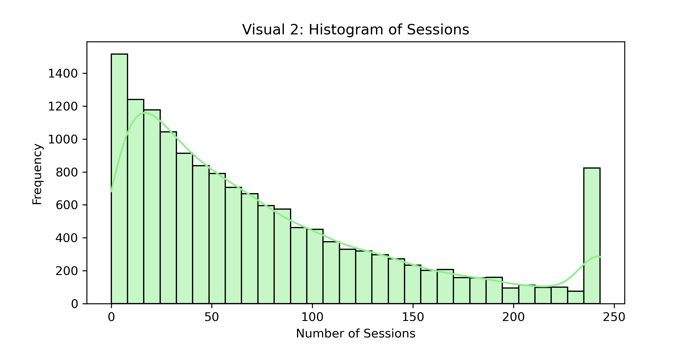
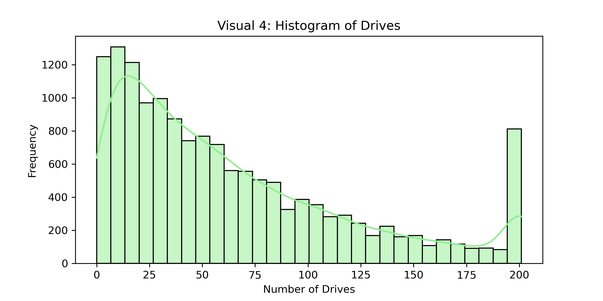
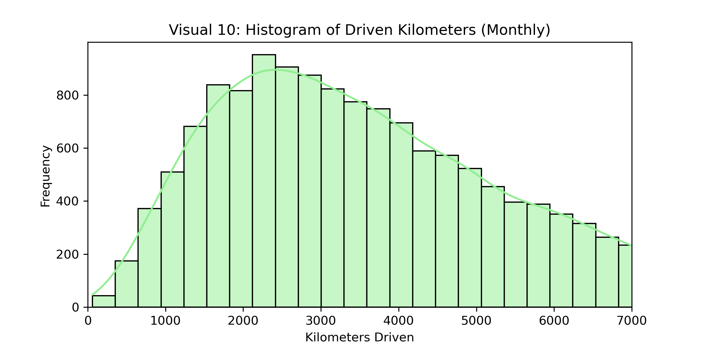
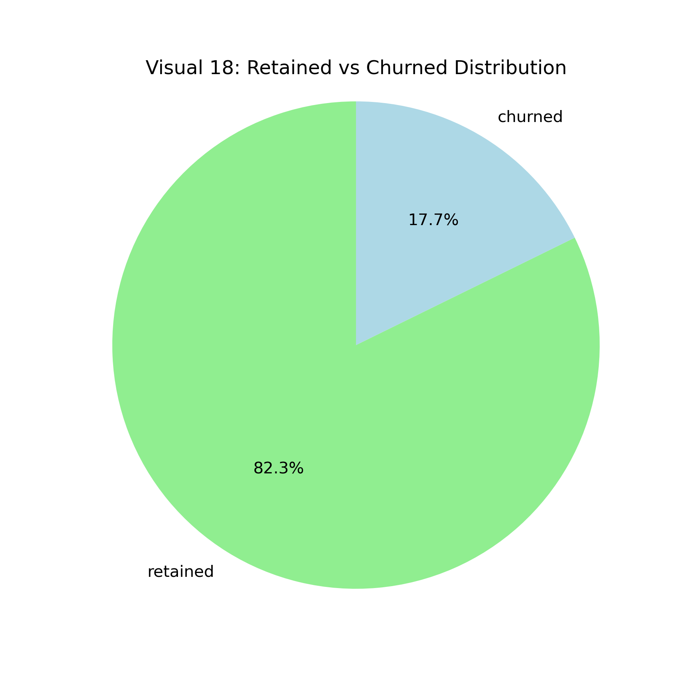
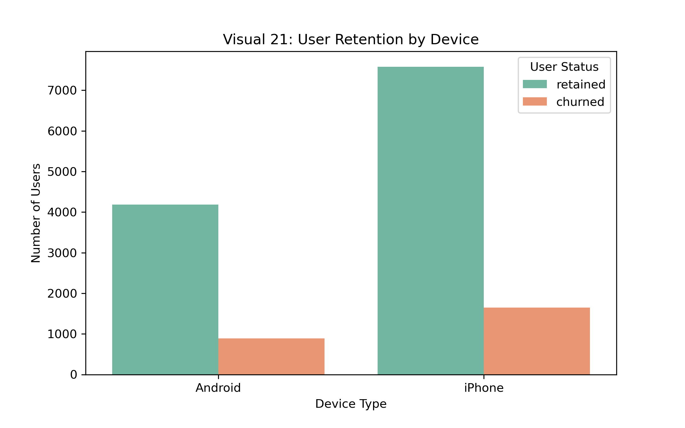
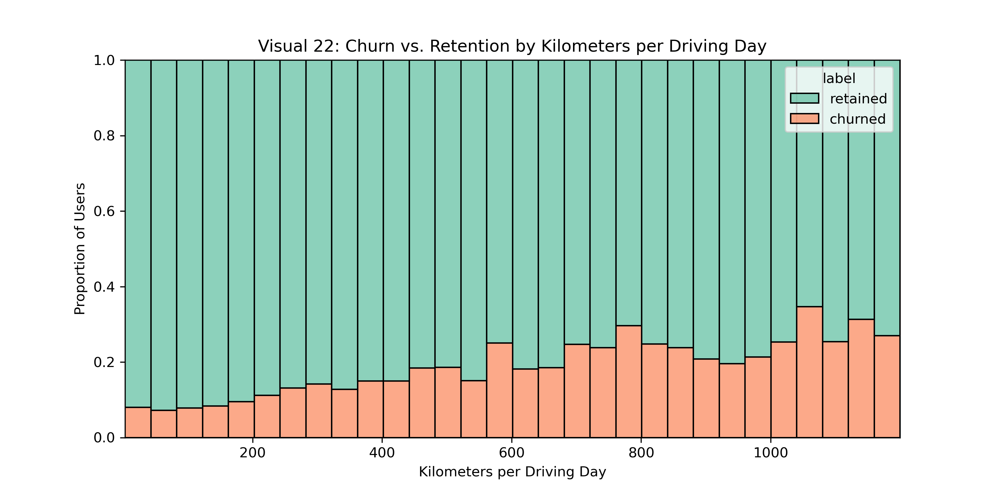
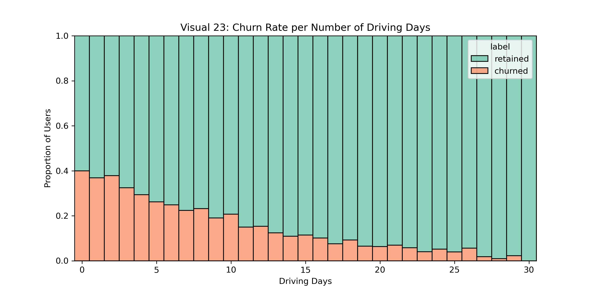
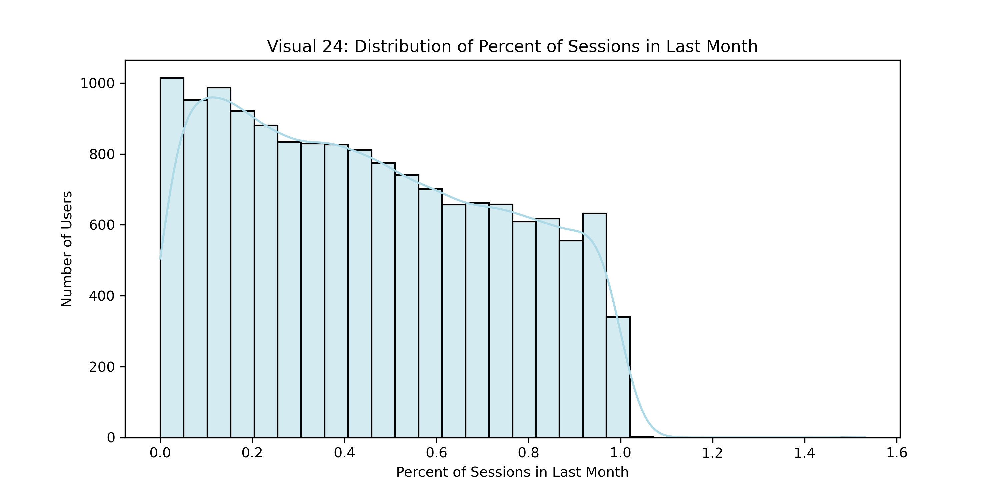

# 🛣️ Waze User Churn Analysis

This project was completed as part of the **Google Advanced Data Analytics Certificate (Course 3)**. It focuses on identifying behavioral patterns in Waze app users that correlate with churn, using exploratory data analysis (EDA), visualization, and feature engineering in Python.

---

## Project Goals

- Explore and clean user-level activity data from Waze
- Visualize behavioral differences between retained and churned users
- Identify early indicators of churn (e.g. session spikes, driving intensity)
- Communicate results in the form of an executive summary

## Executive Summary
Analysis of 15,000+ Waze users revealed that **churners drove less frequently 
but more intensely** (600+ km/day). 42% of their sessions occurred in the 
final month, indicating detectable early warning signals. Recommended: 
targeted onboarding for new users and activity-based churn risk scoring.

---

## Repository Structure

```
waze-churn-analysis/
├── activity_course3.ipynb        # Jupyter Notebook with full EDA
├── visuals/                      # Exported PNGs of key visualizations
└── README.md                     # Project overview & summary
```

---

## Key Visualizations

### Histogram of Sessions  


### Histogram of Drives  


### Histogram of Driven Kilometers (Monthly)  


### Retained vs Churned Distribution  


### User Retention by Device  


### Churn vs Retention by Kilometers per Driving Day  


### Churn Rate per Number of Driving Days  


### Distribution of Percent of Sessions in Last Month  


---

## Summary of Key Insights

- **Churners drove less frequently**, but covered more kilometers per driving day
- Over **42% of their sessions occurred in the final month**
- Churn was **most common among newer users**
- Churn rates were **consistent across device types**

---

## Business Recommendations

- Send personalized onboarding nudges in weeks 1–2
- Flag high-risk users with session spikes or >600 km/day driving
- Investigate long-tenure users with sudden activity bursts before churn
- Develop a churn-risk score using usage intensity & lifetime behavior

---

## Tools & Techniques

- Python: `pandas`, `seaborn`, `matplotlib`
- Jupyter Notebook for analysis & commentary
- Feature creation: `km_per_driving_day`, `percent_sessions_in_last_month`
- Outlier handling (95th percentile), histogram-based ratio comparison

---

## Author

**Jonatan Zemedebrhan**  
Google Advanced Data Analytics Certificate – Course 3  
Waze User Churn Case Study

---

⚠️ **To run this notebook locally**, make sure the file  
`waze_data.csv` is placed in the **same folder** as the notebook.  
This dataset was originally generated inside the Coursera platform and is included in this repository for reproducibility.

